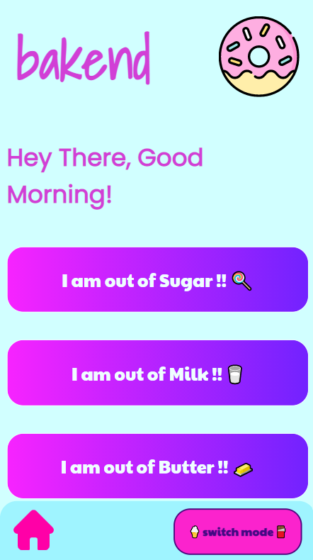

# Bakend 🍩

[](https://travis-ci.org/npm/npm) [](https://www.npmjs.com/package/npm) [](http://makeapullrequest.com) [](https://github.com/your/your-project/blob/master/LICENSE)

This is my capstone project for the [Neue Fische](https://www.neuefische.de/) Web Development Bootcamp attended in Spring 2021

## 🎬 Demo


# 📌 Table of contents

- [Demo](#🎬-demo)
- [Getting Started](#🎉-getting-started)
- [How it works](#📝-how-it-works)
- [Development](#💻-development)
  - [Highlights](#🌟-highlights)
  - [Prerequisites](#✔️-prerequisites)
  - [Contribute](#💞-contribute)
- [Tests](#✅-tests)
- [Project Dependencies](#➕-project-dependencies)
- [Deployment](#🚀-deployment)
- [Library](#📚-library)
- [Contacts](#💌-contacts)

## 🎉 Getting Started

[(Back to top)](#📌-table-of-contents)

To run locally, install the dependencies and run the development server.
First, run the development server:

```shell
npm install
npm run dev
```

Open [http://localhost:3000](http://localhost:3000).

Now you should be able to run it in your own device.

## 📝 How it works

[(Back to top)](#📌-table-of-contents)

Bakend is a baking ingredients converter app. Turned vegan? Or lactose intolerant? Or maybe just forgot to buy milk? Or just happy to experiment and give a personal twist to your cake recipes?

There is a calculator page for each of the basic baking ingredients, such as butter, sugar and milk.

Just type how much butter, sugar or milk you need according to your recipe and choose among the available options your favourite substitute. Bakend will do the maths for you!

The result you get is calculated using the exchange rate of each ingredient.

Would you like to know more of each ingredient stored in the database? Just visit the "Explore" page of the app. There you can type the name of the ingredient you are interested in. You will get the all the results from the directly from database. For each ingredient stored in the database there are nutrition facts and allergies warnings listed.
(The app is for entertainment purposes only and never replaces a physician's advice.
Please check the label of each product before you purchase it.)

## 💻 Development

[(Back to top)](#📌-table-of-contents)

### 🌟 Highlights

- TypeScript
- React
- Next.js
- mongoDB
- Storybook

### ✔️ Prerequisites

None!
Just install all dependencies and you are good to go!

### 💞 Contribute

Would you like to contribute?
Feel free to ✨ add features or 🐛 fix bugs!

```shell
git clone git@github.com:SilviaBarcellini/bakend.git
cd bakend
npm install
npm run dev
```

## ✅ Tests

[(Back to top)](#📌-table-of-contents)

No tests implemented yet.

## ➕ Project Dependencies

[(Back to top)](#📌-table-of-contents)

- https://nextjs.org/learn/excel/typescript
- https://prettier.io/docs/en/install.html
- https://eslint.org/docs/user-guide/getting-started
- https://github.com/prettier/eslint-config-prettier
- https://stylelint.io/user-guide/get-started
- https://github.com/prettier/stylelint-config-prettier
- https://typicode.github.io/husky/
- https://github.com/okonet/lint-staged
- https://storybook.js.org/docs/react/get-started/install
- (https://www.npmjs.com/package/storybook-css-modules-preset)
- [Custom server for next](https://nextjs.org/docs/advanced-features/custom-server)
- [TypeScript for custom server + nodemon](https://github.com/vercel/next.js/tree/canary/examples/custom-server-typescript)

## 🚀 Deployment

[(Back to top)](#📌-table-of-contents)

The game is deployed on Heroku. Play it here: [Bakend](https://bakend-app.herokuapp.com/).

For a better experience use the mobile version, although it works in browser too.

## 📚 Library

[(Back to top)](#📌-table-of-contents)

Icons from [flaticon](https://www.flaticon.com/).
For more info, please visit the Credits page of the App.

## 💌 Contacts

[(Back to top)](#📌-table-of-contents)

Got anything to say? Please feel free to [contact me](https://www.linkedin.com/in/silvia-barcellini)!


